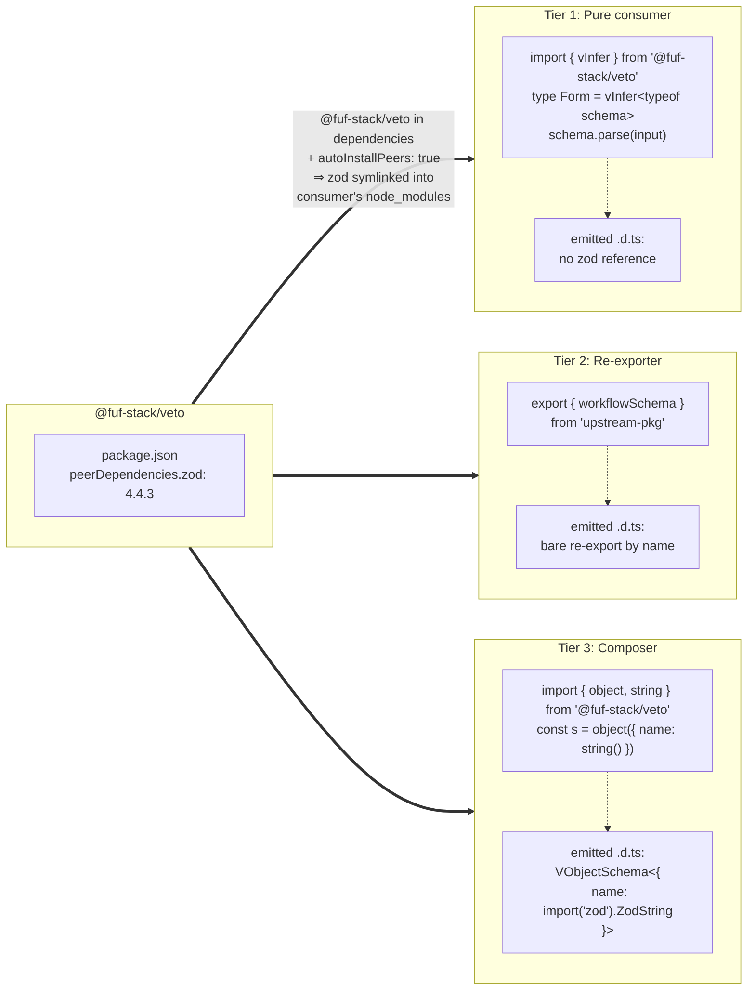

# veto monorepo usage

## TL;DR

**`@fuf-stack/veto` declares `zod` as a `peerDependency`** (pinned to the exact version it was tested against). As long as the consuming project's pnpm config has `autoInstallPeers: true`, using veto in any workspace package requires nothing more than adding it to `dependencies`:

```json
"dependencies": {
  "@fuf-stack/veto": "1.2.0"
}
```

> **The one thing you must configure on the consumer side: `autoInstallPeers: true`** in your project's `pnpm-workspace.yaml` (or `.npmrc`). This pixels monorepo already has it set. Without it, pnpm will not install `zod` automatically and you'll hit `TS2742` / `TS2883` errors on every veto-typed value.

With both pieces in place, pnpm sees veto's peer requirement when installing the consuming package and automatically symlinks `node_modules/zod` into that package's own `node_modules`. TypeScript can then resolve `ZodString`, `ZodObject`, etc. and emit fully-typed, portable declarations. No `publicHoistPattern`, no manual `zod` declaration, no annotations.

Renovate updates veto's `peerDependencies.zod` and `devDependencies.zod` together in lockstep, so consumers always end up on the exact `zod` version veto's CI tested against.

## Consumer levels

A consumer package can use veto in one of three patterns. **All three are covered by the same setup above** — none requires anything beyond adding `@fuf-stack/veto` to `dependencies`.



The Tier 3 case is the one that exercises the full chain: tsc needs to write `import("zod").ZodString` into the consumer's emitted `.d.ts`, and `zod` must be resolvable from that consumer's own `node_modules` for the path to be portable. The `peerDependency` + `autoInstallPeers` mechanism guarantees exactly that.

## When something goes wrong

If you hit `TS2742` or `TS2883` on a veto-typed value, the package is missing its part of the chain. In order:

1. Confirm the package declares `@fuf-stack/veto` (or an upstream wrapper around it) in its own `dependencies`. The compiler error is telling you: "this package composes Zod schemas — it needs the dependency that pulls in the peer."
2. Run `pnpm install` to make sure `autoInstallPeers` actually created the `node_modules/zod` symlink.
3. If both are in place and the error persists, the package is a rare case where the workspace symlink chain doesn't reach `zod` (e.g. it depends on a wrapper that doesn't itself depend on veto). Add `"zod": "4.4.3"` (matching veto's peer pin) to that package's own `dependencies`.

## Background: why a peerDependency

`@fuf-stack/veto` is a thin wrapper around `zod`. Its public API exposes Zod schema types (`ZodObject`, `ZodString`, ...) on the return values of `object()`, `string()`, `vEnum()`, etc. When a consumer package emits `.d.ts` files referencing values inferred from veto schemas, TypeScript must be able to resolve those Zod types to a portable path.

If `zod` is only veto's regular `dependency`, pnpm hides it from consumers (the strict "phantom dependency" rule). TypeScript then either emits `ZodObject<T>` with `T` unbound (degrading silently to `any` downstream) or writes `.pnpm/zod@.../...` paths into the `.d.ts` (which `tsc` itself refuses with `TS2883`).

Declaring `zod` as a `peerDependency` plus `autoInstallPeers: true` makes `zod` a first-class, visible dependency of every consumer, eliminating both failure modes.

## Things that look like fixes but are not

- **`publicHoistPattern: [zod]`** in `pnpm-workspace.yaml`. Hoists `zod` to the workspace root, but `tsc` still emits `.pnpm/zod@.../...` paths when the consuming package has no local `node_modules/zod` symlink. `TS2883` is unaffected.
- **Bundling `zod` into `veto`'s dist** (`deps.noExternal: ['zod']` in `tsdown.config.ts`). Inlines all Zod runtime + types into veto's output. Breaks `instanceof` for any consumer that also uses `zod` directly, explodes the published `.d.ts` size roughly 250x, and produces `TS4023` when consumers reference inlined-but-not-exported names.
- **Explicit type annotations** on every exported schema (`export const s: VObjectSchema<{...}> = object({...})`). Defeats the inference benefit Zod exists to provide.

The only mechanism that actually addresses the root cause is making `zod` resolvable from the consumer's own `node_modules`, which `peerDependencies` + `autoInstallPeers` does automatically.

## See also

- [pnpm overrides guide](./pnpm-overrides.md)
- [tsdown bundling notes](./tsdown-bundling.md)
- [veto v1 upgrade](./veto-v1-upgrade.md)
